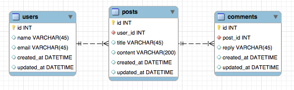

One user can publish many posts, and each post has many comments from anonymous users.

<div align="center">
    
  <p><small>Database relations diagram</small></p>
</div>

This first part is pure Laravel, we will add the GraphQL part afterwards.

Begin by defining models and migrations for your posts and comments

    php artisan make:model -m Post

```php
<?php

namespace App;

use Illuminate\Database\Eloquent\Model;

class Post extends Model
{
    public function user()
    {
        return $this->belongsTo(User::class);
    }

    public function comments()
    {
        return $this->hasMany(Comment::class);
    }
}
```

```php
<?php

use Illuminate\Support\Facades\Schema;
use Illuminate\Database\Schema\Blueprint;
use Illuminate\Database\Migrations\Migration;

class CreatePostsTable extends Migration
{
    public function up()
    {
        Schema::create('posts', function (Blueprint $table) {
            $table->increments('id');
            $table->unsignedInteger('user_id');
            $table->string('title');
            $table->string('content');
            $table->timestamps();
        });
    }

    public function down()
    {
        Schema::dropIfExists('posts');
    }
}
```

    php artisan make:model -m Comment

```php
<?php

namespace App;

use Illuminate\Database\Eloquent\Model;

class Comment extends Model
{
    public function post()
    {
        return $this->belongsTo(Post::class);
    }
}
```

```php
<?php

use Illuminate\Support\Facades\Schema;
use Illuminate\Database\Schema\Blueprint;
use Illuminate\Database\Migrations\Migration;

class CreateCommentsTable extends Migration
{
    public function up()
    {
        Schema::create('comments', function (Blueprint $table) {
            $table->increments('id');
            $table->unsignedInteger('post_id');
            $table->string('reply');
            $table->timestamps();
        });
    }

    public function down()
    {
        Schema::dropIfExists('comments');
    }
}
```

Remember to run the migrations:

    php artisan migrate

Finally, add the `posts` relation to `app/Users.php`

```php
<?php

namespace App;

use Illuminate\Notifications\Notifiable;
use Illuminate\Contracts\Auth\MustVerifyEmail;
use Illuminate\Foundation\Auth\User as Authenticatable;

class User extends Authenticatable
{
    use Notifiable;

    protected $fillable = [
        'name', 'email', 'password',
    ];

    protected $hidden = [
        'password', 'remember_token',
    ];

    public function posts()
    {
        return $this->hasMany(Post::class);
    }
}
```